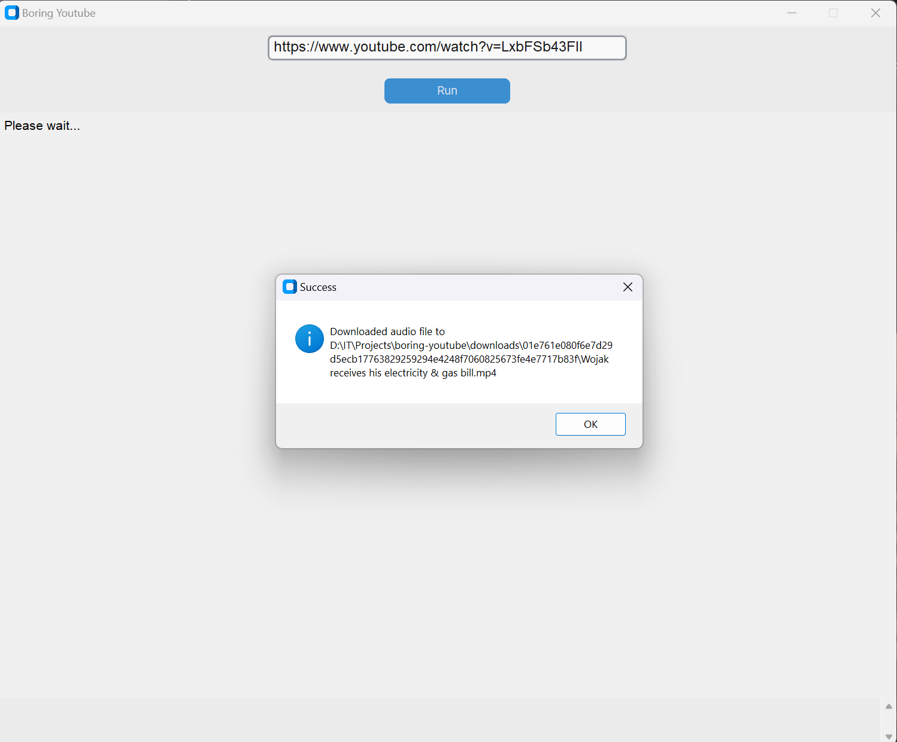

[![Stargazers][stars-shield]][stars-url]
[![Issues][issues-shield]][issues-url]
[![MIT License][license-shield]][license-url]
[![LinkedIn][linkedin-shield]][linkedin-url]


<br />
<div align="center">
  <h2 align="center">Boring Youtube</h2>
  <h4 align="center" style="color: red">Without OpenAI API!</h4>

  <p align="center">
    <a href="https://github.com/DEENUU1/boring-youtube/issues">Report Bug</a>
    ·
    <a href="https://github.com/DEENUU1/boring-youtube/issues">Request Feature</a>
  </p>
</div>


<!-- TABLE OF CONTENTS -->

### Table of Contents
  <ol>
    <li>
      <a href="#about-the-project">About The Project</a>
      <ul>
        <li><a href="#built-with">Built With</a></li>
      </ul>
    </li>
    <li><a href="#key-features">Key features</a></li>
    <li>
      <a href="#getting-started">Getting Started</a>
      <ul>
        <li><a href="#installation">Installation</a></li>
      </ul>
    </li>
    <li><a href="#license">License</a></li>
    <li><a href="#author">Author</a></li>
  </ol>

<!-- ABOUT THE PROJECT -->
## About The Project

Python GUI application for creating transcriptions and summaries for a given Youtube video


  
  
  
  
  
  

### Built With
- Python
- Tkinter
- CustomTkinter
- Langchain
- Whisper (OpenAI)
- Huggingface

## Key Features
  - GUI application
  - Create transcription with Whipser from YouTube video 
  - If it's necessary script chunk the long video into more minor (5 minutes) chunks
  - Script chunk large text into 2000 words 
  - Display summary and transcription in the Tkinter application 
  - Save the transcript and summary into a .txt file 
   

<!-- GETTING STARTED -->
## Getting Started

### Installation and first run 


First, you need to clone this repository
```bash
git clone <link>
```

```commandline
pip install -r requirements.txt
```

```commandline
python main.py
```

<!-- LICENSE -->
## License

Distributed under the MIT License. See `LICENSE.txt` for more information.


## Author

- [@DEENUU1](https://www.github.com/DEENUU1)


<!-- MARKDOWN LINKS & IMAGES -->
<!-- https://www.markdownguide.org/basic-syntax/#reference-style-links -->
[contributors-shield]: https://img.shields.io/github/contributors/DEENUU1/boring-youtube.svg?style=for-the-badge
[contributors-url]: https://github.com/DEENUU1/boring-youtube/graphs/contributors
[forks-shield]: https://img.shields.io/github/forks/DEENUU1/boring-youtube.svg?style=for-the-badge
[forks-url]: https://github.com/DEENUU1/boring-youtube/network/members
[stars-shield]: https://img.shields.io/github/stars/DEENUU1/boring-youtube.svg?style=for-the-badge
[stars-url]: https://github.com/DEENUU1/boring-youtube/stargazers
[issues-shield]: https://img.shields.io/github/issues/DEENUU1/boring-youtube.svg?style=for-the-badge
[issues-url]: https://github.com/DEENUU1/boring-youtube/issues
[license-shield]: https://img.shields.io/github/license/DEENUU1/boring-youtube.svg?style=for-the-badge
[license-url]: https://github.com/DEENUU1/boring-youtube/blob/main/LICENSE
[linkedin-shield]: https://img.shields.io/badge/-LinkedIn-black.svg?style=for-the-badge&logo=linkedin&colorB=555
[linkedin-url]: https://www.linkedin.com/in/kacper-wlodarczyk/